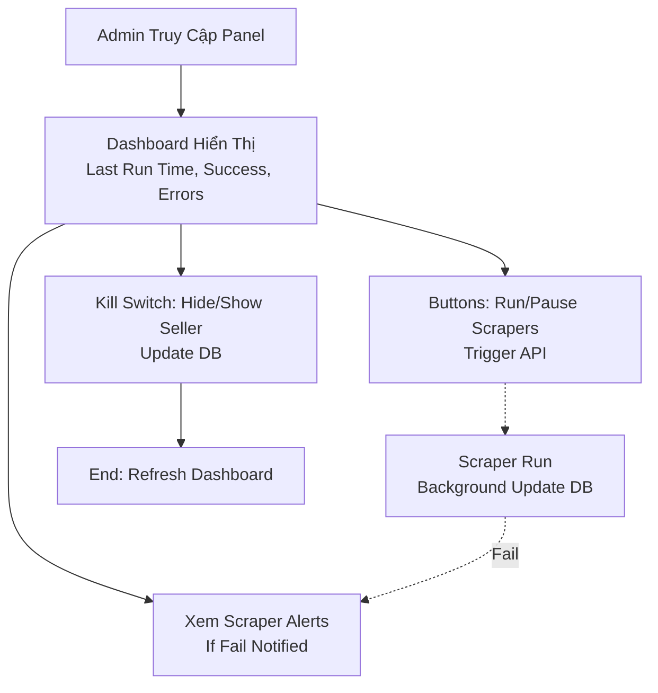

### Luồng Admin Dashboard Trên Website GoodSeed (MVP)

Dựa trên tài liệu "GoodSeed Development Document", admin panel (dashboard) là phần dành cho admin để quản lý scraper và seller, không yêu cầu auth phức tạp ở MVP (có thể dùng basic auth). Luồng tập trung vào dashboard xem health scraper, buttons control (run/pause), kill switch ẩn seller, và nhận alerts nếu scraper fail. Không có manage users (đó là full version). Dưới đây là luồng trọng tâm, mô tả theo bước và sơ đồ Mermaid.

#### Các Bước Chính (Admin Flow)
1. **Truy Cập Admin Panel**: Admin login (nếu có) hoặc truy cập /admin (SSR Next.js, integrate age gate nếu cần).
2. **Vào Dashboard**: Hiển thị chính: Last run time, success/fail status, errors của scrapers (per seller).
3. **Xem Alerts**: Nhận và hiển thị scraper failure alerts (từ email/Slack hoặc DB logs).
4. **Control Scrapers**: Sử dụng buttons để run manual hoặc pause scrapers (gọi API /api/scraper/run).
5. **Kill Switch**: Chọn seller và toggle hide/show (update DB để ẩn products của seller trong search).
6. **End**: Refresh dashboard để xem updates, hoặc logout. Logs/errors tích hợp Sentry/CloudWatch.

Lưu ý: Scraper chạy background, nhưng admin có thể trigger manual. Alerts tự động nếu fail (liên kết với scraper rules).

#### Sơ Đồ Mermaid (Admin Flow)
