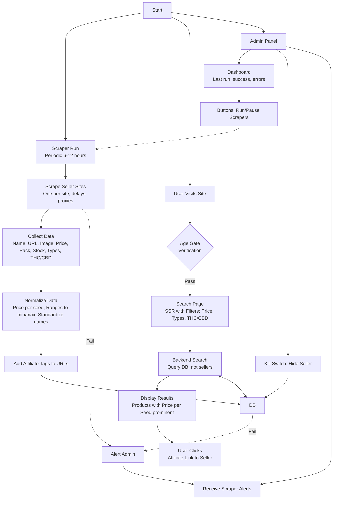

### Sơ Đồ Mô Phỏng Luồng Đi Cho Ứng Dụng GoodSeed

Dựa trên tài liệu "GoodSeed Development Document (Simple Version for Dev)" mà bạn cung cấp, tôi đã phân tích và mô phỏng luồng hoạt động tổng quan của ứng dụng. GoodSeed là một e-commerce aggregator chuyên tìm kiếm hạt giống cannabis: scraper thu thập dữ liệu từ các seller, normalize và lưu vào DB; frontend hiển thị search với filters; admin control scraper và alerts. Luồng này bao gồm 3 phần chính: **Scraper Background Process**, **User Flow**, và **Admin Flow**, tất cả kết nối qua Database (SQL như Postgres/MySQL trên AWS).

Sơ đồ dưới đây được vẽ bằng Mermaid (một công cụ diagram markdown phổ biến, dễ render trên GitHub, VS Code, hoặc các tool như Mermaid Live). Nó giúp hình dung tổng quan hệ thống, từ đó làm cơ sở để setup cấu trúc thư mục dự án (ví dụ: `src/scrapers/` cho luồng scraper, `src/app/` cho frontend routes, `src/lib/` cho DB và normalize utils).

#### Mermaid Diagram (Flowchart)

#### Giải Thích Sơ Đồ
- **Luồng Scraper (Background)**: Chạy định kỳ (6-12 giờ), scrape từng seller (sẽ tạo ra 5-10 hoặc phụ thuộc vào số lượng seller site cần scraper dữ liệu. Ví dụ scaper.leafly.ts, scaper.seedsman.ts, scaper.seedsupreme.ts...) (với rules như delays 2-5s, proxies, log errors), collect/normalize data, add affiliate, lưu vào DB. Nếu fail, gửi alert (email/Slack) đến admin. Đây là "database-first" để search nhanh.
- **Luồng User (Frontend)**: User truy cập → kiểm tra tuổi (age gate) → search với filters (price per seed slider, checkboxes types, THC/CBD range) → backend query DB (không scrape real-time) → hiển thị results (SSR Next.js, price per seed nổi bật) → click affiliate URL đến seller.
- **Luồng Admin**: Truy cập panel → dashboard xem logs/errors → nút run/pause scraper hoặc kill switch ẩn seller → nhận alerts từ scraper fails.
- **Kết Nối Chung**: DB là trung tâm (index fields như price per seed, THC/CBD cho search nhanh). Infrastructure như AWS hosting, Cloudflare caching, Sentry/CloudWatch logging được ngầm định hỗ trợ các luồng.

#### Liên Kết Với Setup Thư Mục Dự Án
Sơ đồ này làm cơ sở để tổ chức thư mục Next.js một cách logic, dựa trên các luồng:
- **@/scrapers/**: Chứa files cho luồng scraper (one file per site, index.ts để run all với delays/proxies/alerts).
- **@/app/**: Routes cho user flow (e.g., /search/page.tsx cho search page + filters, /api/search/route.ts cho backend query DB) và admin (/admin/dashboard/page.tsx cho dashboard, buttons, kill switch).
- **@/lib/**: Utils cho normalize data, prisma.ts cho DB connections (store/update data).
- **@/components/**: UI reusable như Filters/ (sliders/checkboxes), ProductCard.tsx (display results với affiliate links).
- **@/prisma/**: Schema cho DB models (Product với fields normalized như pricePerSeed, thcMin/Max).

Cấu trúc này đảm bảo tách biệt (scraper background vs frontend SSR), dễ scale sang full version (accounts, notifications). Nếu cần chỉnh sửa sơ đồ (e.g., thêm chi tiết full version), hoặc export thành hình ảnh, hãy cho tôi biết!