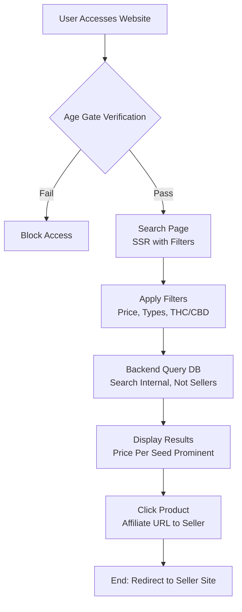

### User Flow on the GoodSeed Website (MVP)

Based on the "GoodSeed Development Document", the MVP focuses on simple search without accounts/login (that's for the full version). The user flow is "database-first": Searching the internal DB, no real-time scraping. Below is the core flow, described in steps and a simple Mermaid diagram for easy visualization.

#### Key Steps (User Flow)
1. **Access Website**: User opens browser and accesses the homepage (SSR with Next.js/Nuxt.js).
2. **Age Gate Verification**: Check age (integrate with existing pages). If underage (e.g., <18/21), block; if pass, enter the site.
3. **Enter Search Page**: Display the search interface with default filters (price per seed, types, THC/CBD). Show price per seed prominently in results.
4. **Apply Filters/Search**: 
   - Price per Seed: Slider + min/max inputs.
   - Seed Type: Checkboxes (Regular, Feminized, Autoflower).
   - Cannabis Type: Checkboxes (Sativa, Indica, Mix).
   - THC/CBD Range: Slider + numeric inputs.
   - Submit to query backend (/api/search, search DB not affiliate partner sites).
5. **View Results**: Display list of seeds (name, image, price per seed, stock, types, THC/CBD %). Data from DB (normalized: price per seed = total/pack, ranges to min/max).
6. **Click Redirect**: User clicks seedcard → redirects to seller URL with affiliate tags (earn commission). For example: https://seedsupreme.com/feminized-seeds.html?aff=goodseed
7. **End**: No favorites/notifications in MVP; user can refresh filters to search again.

Note: Scrapers run in the background (every 6-12 hours) to update DB, without affecting user flow. If scraper fails, only admin receives alert.

#### Mermaid Diagram (User Flow)
